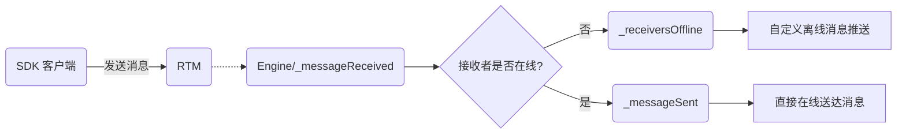
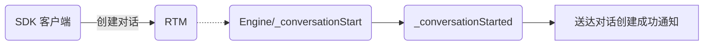
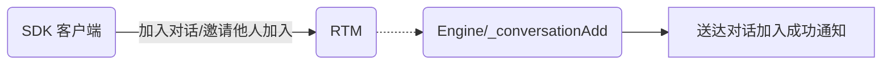
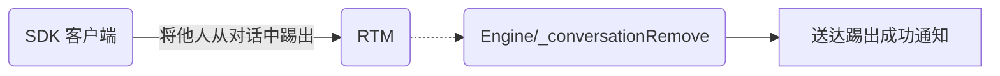
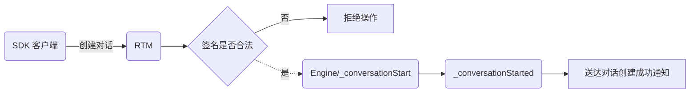




{{ docs.defaultLang('js') }}

# 即时通讯开发指南：解决权限管理、敏感词过滤、多端同步等需求的方法

## 本章导读

在[前一章](realtime-guide-intermediate.html)的基础之上，本文档演示了对话的权限管理、多端登录以及敏感词过滤等功能的使用方法，自此开发者应该可以基于 LeanCloud 即时通讯服务完成一个相对复杂的社交产品。

## 敏感词过滤和掉线通知

### 敏感词过滤

敏感词在[即时通讯服务总览#敏感词过滤](realtime_v2.html#敏感词过滤)有介绍，这是默认选项，而一些特殊场景中，可能会有一些自定义敏感词的需求，因此在控制台->消息->设置页面可以开关这个功能，并且还可以提交自定义敏感词的词库。

### 掉线通知 - 遗愿消息

遗愿消息是在一个用户突然掉线之后，系统自动通知对话的其他成员关于该成员已掉线的消息。好似在掉线后要给对话中的其他成员一个妥善的交待，所以被戏称为「遗愿」消息，如下图中的「Tom 已掉线，无法收到消息」。


要发送遗愿消息，用户需要设定好消息内容（可能包含了一些业务逻辑相关的内容）发给云端，云端并不会将其马上发送给对话的成员，而是缓存下来，一旦检测到该用户掉线，云端立即将这条遗愿消息发送出去。开发者可以利用它来构建自己的断线通知的逻辑。

```js
var message = new TextMessage('我掉线了');
conversation.send(message, { will: true }).then(function() {
  // 发送成功，当前 client 掉线的时候，这条消息会被下发给对话里面的其他成员
}).catch(function(error) {
  // 异常处理
});
```
```objc
AVIMMessageOption *option = [[AVIMMessageOption alloc] init];
option.will = YES;

AVIMMessage *willMessage = [AVIMTextMessage messageWithText:@"I'm offline." attributes:nil];

[conversaiton sendMessage:willMessage option:option callback:^(BOOL succeeded, NSError * _Nullable error) {
    if (succeeded) {
        NSLog(@"Will message has been sent.");
    }
}];
```
```java
AVIMTextMessage message = new AVIMTextMessage();
message.setText("我是一条遗愿消息，当发送者意外下线的时候，我会被下发给对话里面的其他成员");

AVIMMessageOption option = new AVIMMessageOption();
option.setWill(true);
conversation.sendMessage(message, option, new AVIMConversationCallback() {
  @Override
  public void done(AVIMException e) {
    if (e == null) {
      // 发送成功
    }
  }
});
```
```cs
var message = new AVIMTextMessage()
{
    TextContent = "我是一条遗愿消息，当发送者意外下线的时候，我会被下发给对话里面的其他成员"
};
var sendOptions = new AVIMSendOptions()
{
    Will = true
};
await conversation.SendAsync(message, sendOptions);
```

## 在云端进行消息控制

即时通讯服务通过云引擎服务可以实现 Hook 函数的功能：

> 开发者在服务端定义一些 Hook 函数，在对话创建/消息发送等函数被调用的时候，即时通讯服务会调用这些 Hook 函数，让开发者更自由的控制业务逻辑。

举个例子，做一个游戏聊天系统的时候，要合理地屏蔽一些竞争对手游戏的关键字，以下是使用云引擎支持的各种服务端编程语言实现这个函数的代码：

```js
AV.Cloud.onIMMessageReceived((request) => {
    // request.params = {
    //     fromPeer: 'Tom',
    //     receipt: false,
    //     groupId: null,
    //     system: null,
    //     content: '{"_lctext":"来我们去XX传奇玩吧","_lctype":-1}',
    //     convId: '5789a33a1b8694ad267d8040',
    //     toPeers: ['Jerry'],
    //     __sign: '1472200796787,a0e99be208c6bce92d516c10ff3f598de8f650b9',
    //     bin: false,
    //     transient: false,
    //     sourceIP: '121.239.62.103',
    //     timestamp: 1472200796764
    // };

    let content = request.params.content;
    console.log('content', content);
    let processedContent = content.replace('XX传奇', '**');
    // 必须含有以下语句给服务端一个正确的返回，否则会引起异常
  return {
    content: processedContent
  };
});
```
```python
@engine.define
def _messageReceived(**params):
    # params = {
    #     'fromPeer': 'Tom',
    #     'receipt': false,
    #     'groupId': null,
    #     'system': null,
    #     'content': '{"_lctext":"来我们去XX传奇玩吧","_lctype":-1}',
    #     'convId': '5789a33a1b8694ad267d8040',
    #     'toPeers': ['Jerry'],
    #     '__sign': '1472200796787,a0e99be208c6bce92d516c10ff3f598de8f650b9',
    #     'bin': false,
    #     'transient': false,
    #     'sourceIP': '121.239.62.103',
    #     'timestamp': 1472200796764,
    # }
    print('_messageReceived start')
    content = json.loads(params['content'])
    text = content._lctext
    print('text:', text)
    processed_content = text.replace('XX传奇', '**')
    print('_messageReceived end')
    # 必须含有以下语句给服务端一个正确的返回，否则会引起异常
    return {
        'content': processed_content,
    }
```
```php
Cloud::define("_messageReceived", function($params, $user) {
    // params = {
    //     fromPeer: 'Tom',
    //     receipt: false,
    //     groupId: null,
    //     system: null,
    //     content: '{"_lctext":"来我们去XX传奇玩吧","_lctype":-1}',
    //     convId: '5789a33a1b8694ad267d8040',
    //     toPeers: ['Jerry'],
    //     __sign: '1472200796787,a0e99be208c6bce92d516c10ff3f598de8f650b9',
    //     bin: false,
    //     transient: false,
    //     sourceIP: '121.239.62.103',
    //     timestamp: 1472200796764
    // };

    error_log('_messageReceived start');
    $content = json_decode($params["content"], true);
    $text = $content["_lctext"];
    error_log($text);
    $processedContent = preg_replace("XX传奇", "**", $text);
    return array("content" => $processedContent);
});
```
```java
@IMHook(type = IMHookType.messageReceived)
  public static Map<String, Object> onMessageReceived(Map<String, Object> params) {
    // 打印整个 Hook 函数的参数
    System.out.println(params);
    Map<String, Object> result = new HashMap<String, Object>();
    // 获取消息内容
    String content = (String)params.get("content");
    // 转化成 Map 格式
    Map<String,Object> contentMap = (Map<String,Object>)JSON.parse(content);
    // 读取文本内容
    String text = (String)(contentMap.get("_lctext").toString());
    // 过滤广告内容
    String processedContent = text.replace("XX中介", "**");
    // 将过滤之后的内容发还给服务端
    result.put("content",processedContent);
    return result;
  }
```
```cs
```

而实际上启用上述代码之后，一条消息的时序图如下：

```seq
SDK->RTM: 1.发送消息
RTM-->Engine: 2.触发 _messageReceived hook 调用
Engine-->RTM: 3.返回 hook 函数处理结果
RTM-->SDK: 4.将 hook 函数处理结果发送给接收方
```

- 上图假设的是对话所有成员都在线，而如果有成员不在线，流程有些不一样，下一节会做介绍。
- RTM 表示即时通讯服务集群，Engine 表示云引擎服务集群，它们基于内网通讯。

### 消息 Hook

前一小节介绍的是最为常见的**服务端收到消息时的 Hook，并且所有成员都在线**，而完整的消息 Hook 的生命周期和执行顺序如下图所示：



而 `_receiversOffline` 触发条件是：

>在消息发送完成时触发、对话中某些用户却已经下线，此时可以根据发送的消息来生成离线消息推送的标题等等。例如截取所发送消息的前 6 个字符作为推送的标题：

示例代码如下：

```js
AV.Cloud.onIMReceiversOffline((request) => {
    let params = request.params;
    let content = params.content;

  // params.content 为消息的内容
    let shortContent = content;

    if (shortContent.length > 6) {
        shortContent = content.slice(0, 6);
    }

    console.log('shortContent', shortContent);

  return {
    pushMessage: JSON.stringify({
          // 自增未读消息的数目，不想自增就设为数字
          badge: "Increment",
          sound: "default",
          // 使用开发证书
          _profile: "dev",
          alert: shortContent
      })
  }
});
```
```python
@engine.define
def _receiversOffline(**params):
    print('_receiversOffline start')
    # params['content'] 为消息内容
    content = params['content']
    short_content = content[:6]
    print('short_content:', short_content)
    payloads = {
        # 自增未读消息的数目，不想自增就设为数字
        'badge': 'Increment',
        'sound': 'default',
        # 使用开发证书
        '_profile': 'dev',
        'alert': short_content,
    }
    print('_receiversOffline end')
    return {
        'pushMessage': json.dumps(payloads),
    }
```
```php
Cloud::define('_receiversOffline', function($params, $user) {
    error_log('_receiversOffline start');
    // content 为消息的内容
    $shortContent = $params["content"];
    if (strlen($shortContent) > 6) {
        $shortContent = substr($shortContent, 0, 6);
    }

    $json = array(
        // 自增未读消息的数目，不想自增就设为数字
        "badge" => "Increment",
        "sound" => "default",
        // 使用开发证书
        "_profile" => "dev",
        "alert" => shortContent
    );

    $pushMessage = json_encode($json);
    return array(
        "pushMessage" => $pushMessage,
    );
});
```
```java
@IMHook(type = IMHookType.receiversOffline)
  public static Map<String, Object> onReceiversOffline(Map<String, Object> params) {
    String alert = (String)params.get("content");
    if(alert.length() > 6){
      alert = alert.substring(0, 6);
    }
    System.out.println(alert);
    Map<String, Object> result = new HashMap<String, Object>();
    JSONObject object = new JSONObject();
    object.put("badge", "Increment");
    object.put("sound", "default");
    object.put("_profile", "dev");
    object.put("alert", alert);
    result.put("pushMessage", object.toString());
    return result;
}
```
```cs
```

`_messageSent` 的触发时机在消息发送完成之后触发，此时可以做一些日志记录相关的操作，例如消息发送完后，在云引擎中打印一下日志：

```js
AV.Cloud.onIMMessageSent((request) => {
    console.log('params', request.params);

    // 在云引擎中打印的日志如下：
    // params { fromPeer: 'Tom',
    //   receipt: false,
    //   onlinePeers: [],
    //   content: '12345678',
    //   convId: '5789a33a1b8694ad267d8040',
    //   msgId: 'fptKnuYYQMGdiSt_Zs7zDA',
    //   __sign: '1472703266575,30e1c9b325410f96c804f737035a0f6a2d86d711',
    //   bin: false,
    //   transient: false,
    //   sourceIP: '114.219.127.186',
    //   offlinePeers: [ 'Jerry' ],
    //   timestamp: 1472703266522 }
});
```
```python
@engine.define
def _messageSent(**params):
    print('_messageSent start')
    print('params:', params)
    print('_messageSent end')
    return {}

# 在云引擎中打印的日志如下：
# _messageSent start
# params: {'__sign': '1472703266575,30e1c9b325410f96c804f737035a0f6a2d86d711',
#  'bin': False,
#  'content': '12345678',
#  'convId': '5789a33a1b8694ad267d8040',
#  'fromPeer': 'Tom',
#  'msgId': 'fptKnuYYQMGdiSt_Zs7zDA',
#  'offlinePeers': ['Jerry'],
#  'onlinePeers': [],
#  'receipt': False,
#  'sourceIP': '114.219.127.186',
#  'timestamp': 1472703266522,
#  'transient': False}
# _messageSent end
```
```php
Cloud::define('_messageSent', function($params, $user) {
    error_log('_messageSent start');
    error_log('params' . json_encode($params));
    return array();

    // 在云引擎中打印的日志如下：
    // _messageSent start
    // params { fromPeer: 'Tom',
    //   receipt: false,
    //   onlinePeers: [],
    //   content: '12345678',
    //   convId: '5789a33a1b8694ad267d8040',
    //   msgId: 'fptKnuYYQMGdiSt_Zs7zDA',
    //   __sign: '1472703266575,30e1c9b325410f96c804f737035a0f6a2d86d711',
    //   bin: false,
    //   transient: false,
    //   sourceIP: '114.219.127.186',
    //   offlinePeers: [ 'Jerry' ],
    //   timestamp: 1472703266522 }
});
```
```java
@IMHook(type = IMHookType.messageSent)
  public static Map<String, Object> onMessageSent(Map<String, Object> params) {
    System.out.println(params);
    Map<String, Object> result = new HashMap<String, Object>();
    // ...
    return result;
}
```
```cs
```

### 对话 Hook

对话的创建/加入/退出/加人/删人都会有对应的 Hook。

客户端发起创建对话的 Hook 流程图：



`_conversationStart` 的触发条件是：

> 创建对话，在签名校验（如果开启）之后、实际创建之前触发

成员加入时的 Hook 流程图如下：



对应的成员离开时的 Hook 流程图如下：



注意：此处有一个与 `_conversationAdd` 不同之处，自己退出对话，不会触发 `_conversationRemove`

Hook 函数的示例代码请根据所需语言了解更多：

- [PHP#即时通讯 Hook 函数](leanengine_cloudfunction_guide-php.html#即时通讯 Hook 函数)
- [NodeJS#即时通讯 Hook 函数](leanengine_cloudfunction_guide-node.html#即时通讯 Hook 函数)
- [Python#即时通讯 Hook 函数](leanengine_cloudfunction_guide-python.html#即时通讯 Hook 函数)
- [Java#即时通讯 Hook 函数](leanengine_cloudfunction_guide-java.html#即时通讯 Hook 函数)

## 安全与权限

即时通讯采用基于签名的权限控制，关于签名的基本概念请阅读[即时通讯服务总览-权限和认证](realtime_v2.html#权限和认证)。

### 签名鉴权与 Hook 的关系 

对话的权限控制与 Hook 有一些关联，对话级别上的所有 Hook 触发都有另外一个前置条件：

> 该操作的签名是确认合法的，LeanCloud 即时通讯服务器(RTM) 确认校验通过之后，才会去 Engine 服务器调用 Hook

因此，加上签名的校验这一步，创建对话的完整的流程图如下：



### 多端消息同步与单点登录

一个用户可以使用相同的账号在不同的客户端上登录（例如网页版和手机客户端可以同时接收到消息和回复消息，实现多端消息同步），而有一些场景下，需要禁止一个用户同时在不同客户端登录（单点登录），而即时通讯服务也提供了这样的接口，来应对不同的需求：

下面我们来详细说明：如何使用 LeanCloud SDK 去实现单点登录

#### 设置登录标记 Tag

假设开发者想实现 QQ 这样的功能，那么需要在登录到云端的时候，也就是打开与云端长连接的时候，标记一下这个链接是从什么类型的客户端登录到云端的：

```js
realtime.createIMClient('Tom', { tag: 'Mobile' }).then(function(tom) {
  console.log('Tom 登录');
});
```
```objc
AVIMClient *currentClient = [[AVIMClient alloc] initWithClientId:@"Tom" tag:@"Mobile"];
[currentClient openWithCallback:^(BOOL succeeded, NSError *error) {
    if (succeeded) {
        // 与云端建立连接成功
    }
}];
```
```java
// 第二个参数：登录标记 Tag
AVIMClient currentClient = AVIMClient.getInstance(clientId,"Mobile");
currentClient.open(new AVIMClientCallback() {
  @Override
  public void done(AVIMClient avimClient, AVIMException e) {
    if(e == null){
      // 与云端建立连接成功
    }
  }
});
```
```cs
AVIMClient tom = await realtime.CreateClientAsync("Tom", tag: "Mobile", deviceId: "your-device-id");
```

上述代码可以理解为 LeanCloud 版 QQ 的登录，而另一个带有同样 Tag 的客户端打开连接，则较早前登录系统的客户端会被强制下线。

#### 处理登录冲突

我们可以看到上述代码中，登录的 Tag 是 `Mobile`。当存在与其相同的 Tag 登录的客户端，较早前登录的设备会被云端强行下线，而且他会收到被云端下线的通知：

```js
var { Event } = require('leancloud-realtime');
tom.on(Event.CONFLICT, function() {
  // 弹出提示，告知当前用户的 Client Id 在其他设备上登陆了
});
```
```objc
-(void)client:(AVIMClient *)client didOfflineWithError:(NSError *)error{
    if ([error code]  == 4111) {
        //适当的弹出友好提示，告知当前用户的 Client Id 在其他设备上登陆了
    }
};
```
```java
public class MyApplication extends Application{
  public void onCreate(){
   ...
   AVOSCloud.initialize(this,"{{appid}}","{{appkey}}");
   // 自定义实现的 AVIMClientEventHandler 需要注册到 SDK 后，SDK 才会通过回调 onClientOffline 来通知开发者
   AVIMClient.setClientEventHandler(new AVImClientManager());
   ...
  }
}

public class AVImClientManager extends AVIMClientEventHandler {
  ...
  @Override
  public void onClientOffline(AVIMClient avimClient, int i) {
    if(i == 4111){
      // 适当地弹出友好提示，告知当前用户的 Client Id 在其他设备上登陆了
    }
  }
  ...
}
```
```cs
tom.OnSessionClosed += Tom_OnSessionClosed;
private void Tom_OnSessionClosed(object sender, AVIMSessionClosedEventArgs e)
{
}
```

如上述代码中，被动下线的时候，云端会告知原因，因此客户端在做展现的时候也可以做出类似于 QQ 一样友好的通知。

> 如果不设置 Tag，则默认允许用户可以多端登录，并且消息会实时同步。


## 高级功能

### 对话权限

「对话权限」功能作为即时通讯的一项补充，可以将对话内成员划分成不同角色，实现类似 QQ 群管理员的效果。使用这个功能需要在控制台 即时通讯-设置 中开启「对话成员属性功能（成员角色管理功能）」。

目前系统内的角色与功能对应关系：

| 角色 | 功能列表 |
| ---------|--------- |
| Owner | 永久性禁言、踢人、加人、拉黑、更新他人权限 |
| Manager | 永久性禁言、踢人、加人、拉黑、更新他人权限 |
| Member | 加人 |

需要注意一点，目前不支持 Owner 的变更。

### 黑名单

「黑名单」功能可以实现类似微信 屏蔽 的效果，目前分为两大类

- 对话 --> 成员
- 成员 --> 对话

使用这个功能需要在控制台 即时通讯-设置 中开启「黑名单功能」。


## REST API

即时通讯 REST API 的目的是为了给开发者提供一个不依赖 SDK 的高级功能接口。首先请阅读[即时通讯 REST API 使用指南 v2](realtime_rest_api_v2.html)。
